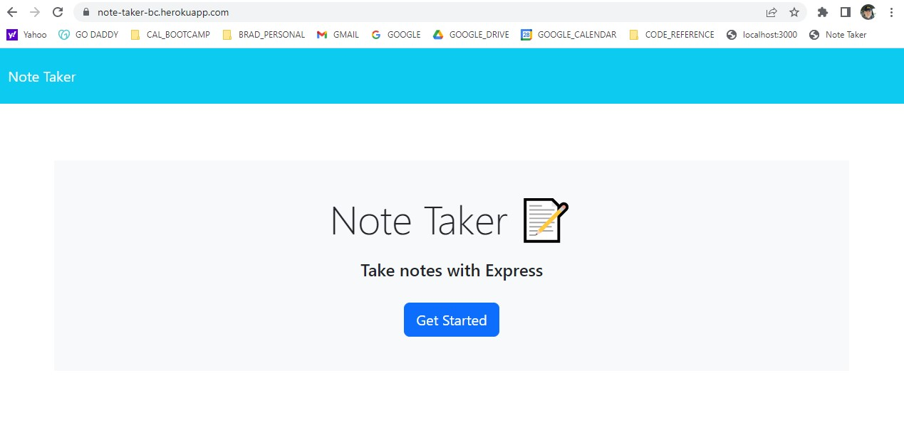
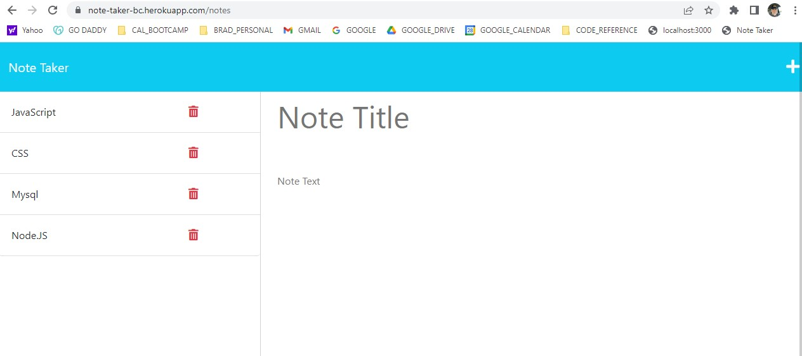

# note-taker

# **Table of Contents**
1. [Description](#description)
2. [Testing](#testing)
3. [Technology Used and Credits](#technology-used-and-credits)
4. [About the Author](#about-the-author)
5. [License](#license)

Deployed Site: https://note-taker-bc.herokuapp.com/


# **Description**

The goal of this project was to create the back end of a website using Express.js. Using starter code that includes the html, css and index.js files, my focus of this project was to learn and implement server side interaction using Express.js.  This was the fist time that I used Express.js and I learned how to save a user's input into a JSON file.  I created 5 endpoints - 3 using the GET method, one using the POST method and one using the DELETE method.  Further, this was the first time that I used the Heroku service to host a website.  (See link below)  

Below is a screen shot of the the landing page.  



When the "get started" button is clicked then the user is directed to the notes.html page that contains the current active notes and the ability to enter a new note.  Additionally, the user can delete any note simply by clicking the trash can icon next to each note. 




# **Highlighted Code Example**

The following is code that I created that I would like to highlight.  

This first code block shows the use of the POST method in express.  This function handles a user's new note post and adds this note title and note text to the JSON file where all notes are stored.  The function retrieves the current contents of JSON file, parses it and then I push the contents of the new post to this array.  After the array is updated the array is then re-stringified and its content is re-written to the db.json file. 

```
app.post("/api/notes", (req, res) => {
  //Log that a POST request was received
  console.log(`${req.method} request received to add a note`);
  //Destructure the assignment of the items in the form submission
  const { title, text } = req.body;

  //Check to ensure that all fields are populated
  if (title && text) {
    const newNote = {
      title,
      text,
      id: unique()
    };
    //Retrieve current list of notes
    fs.readFile("./db/db.json", "utf-8", (err, data) => {
      console.log(data);
      //Parse the json file
      var notesDbParsed = JSON.parse(data);
      //Push the added note to the array
      notesDbParsed.push(newNote);
      //Stringify the array
      var notesDbStringified = JSON.stringify(notesDbParsed);
      //Write string to a file
      fs.writeFile("./db/db.json", notesDbStringified, (err) =>
        err
          ? console.log(err)
          : console.log(`Note has been written to JSON file`)
      );
    });
  }
});
```

In the code block below I demonstrate the DELETE function in Express.js.  In this instance a user desires to delete a note from the JSON file.  The note id is retrieved from the client.  The current JSON file that contains all active notes is retrieved and parsed into an array.  I then used the filter method to filter the array to exclude the object that corresponds to the note id that is being requested to be deleted. 

```
//Delete command with param of 'id' to accept id from client
app.delete("/api/notes/:id", (req, res) => {
  //Deconstructs req.params to use element of 'id' as a variable
  const { id } = req.params;
  //Console Logs message that a DELETE request has been received.
  console.log(`${req.method} request received to delete a note with id: ${id}`);

  //Retrieve current list of notes from db.json file
  fs.readFile("./db/db.json", "utf-8", (err, data) => {
    //Parse the db.json file in order to be able to use array methods
    var notesDbParsed = JSON.parse(data);
    console.log(notesDbParsed);

    //Remove the note using filter method and create new array that excludes the requested note id
    var newNoteArray = notesDbParsed.filter((data) => data.id != id);
    console.log(newNoteArray);

    //Stringify the new array that excludes the requested note id
    var newNotesArrayStringified = JSON.stringify(newNoteArray);

    //Write the stringified new array to the db.json file
    fs.writeFile("./db/db.json", newNotesArrayStringified, (err) =>
      err
        ? console.log(err)
        : console.log(`Note has been removed from JSON file`)
    );
  });
});

```

# **Testing** 

To test to ensure the code rendered the desired output I iterated a series of tests to ensure that all acceptance criteria were met and documented completion below:

| User Acceptance Criteria | Test Result | 
| ------------- |:-------------| 
|1. WHEN I open the Note Taker THEN I am presented with a landing page with a link to a notes page   |**Completed**.  The landing page is loaded and the user is presented with a link to notes (click the "get started" button)    |
|2. WHEN I click on the link to the notes page THEN I am presented with a page with existing notes listed in the left-hand column, plus empty fields to enter a new note title and the note’s text in the right-hand column   |**Completed**.  The the notes page is loaded and existing notes are loaded and shown in the left column.    |
|3. WHEN I enter a new note title and the note’s text THEN a Save icon appears in the navigation at the top of the page   |**Completed**.  When the user enters BOTH a title and the note text then a save icon is presented in the upper left hand corner of the website.    |
|4. WHEN I click on the Save icon THEN the new note I have entered is saved and appears in the left-hand column with the other existing notes   |**Completed**.  When the save icon is clicked the note title and the note text is saved and displayed in the left hand column.   |
|5. WHEN I click on an existing note in the list in the left-hand column THEN that note appears in the right-hand column   |**Completed**.  When a note title in the left hand column is pressed then the text content and the note title of that note appears in the right hand column.    |
|6. WHEN I click on the Write icon in the navigation at the top of the page THEN I am presented with empty fields to enter a new note title and the note’s text in the right-hand column    |**Completed**.  When the Write icon is pressed a new form is presented with empty fields to enter a new note title and note text.    |

This site was deployed using Heroku.  I tested the deployed site on 8 different computers and users. 


# **Technology Used and Credits**

I used many useful references in completing this project including the following.  In particular, I found the layout of the w3schools reference materials to be extremely intuitive and helpful.  They even have a "try me" feature where elements of code can be reviewed and tested.   Other technologies used in this project include:


| Technology Used | Resource URL | 
| ------------- |:-------------| 
|  | [https://git-scm.com/](https://git-scm.com/) | 
|  | [https://developer.mozilla.org/en-US/docs/Learn/JavaScript](https://developer.mozilla.org/en-US/docs/Learn/JavaScript) |
|  | [https://nodejs.org/en/](https://nodejs.org/en/) |
|  | [https://expressjs.com/](https://expressjs.com/) |

# **About the Author**

My name is Brad Coleman. I am fairly new to web development but have considered it a hobby for several years and have hacked my way through learning various aspects including php, html and mysql.  I am currently enrolled in the Cal Berkeley Extension Web Development Boot camp and am excited to learn web development more holistically.  I have spent my earlier career working as a corporate controller / CPA.

- [Linkedin Profile](https://www.linkedin.com/in/brad-coleman-109529/)
- [GitHub Repos](https://github.com/bradcoleman60?tab=repositories)


# **License**

MIT License

Copyright (c) 2022 Brad Coleman

Permission is hereby granted, free of charge, to any person obtaining a copy
of this software and associated documentation files (the "Software"), to deal
in the Software without restriction, including without limitation the rights
to use, copy, modify, merge, publish, distribute, sublicense, and/or sell
copies of the Software, and to permit persons to whom the Software is
furnished to do so, subject to the following conditions:

The above copyright notice and this permission notice shall be included in all
copies or substantial portions of the Software.

THE SOFTWARE IS PROVIDED "AS IS", WITHOUT WARRANTY OF ANY KIND, EXPRESS OR
IMPLIED, INCLUDING BUT NOT LIMITED TO THE WARRANTIES OF MERCHANTABILITY,
FITNESS FOR A PARTICULAR PURPOSE AND NONINFRINGEMENT. IN NO EVENT SHALL THE
AUTHORS OR COPYRIGHT HOLDERS BE LIABLE FOR ANY CLAIM, DAMAGES OR OTHER
LIABILITY, WHETHER IN AN ACTION OF CONTRACT, TORT OR OTHERWISE, ARISING FROM,
OUT OF OR IN CONNECTION WITH THE SOFTWARE OR THE USE OR OTHER DEALINGS IN THE
SOFTWARE.

